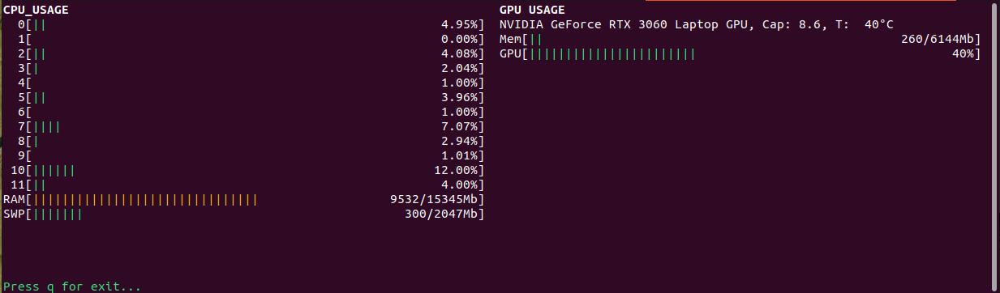

# System monitor

A simple program for monitor cpu and gpu usage

## Features:
- monitor cpu usage;
- monitor gpu usage (only Nvidia for now)

## Plans:
- monitor running cpu and gpu process;
- interact running process (e.g. terminate and kill);
- more interactive UI with possibility to config;
- better error handling and user warning.

## Installation:

For current time only build from source

